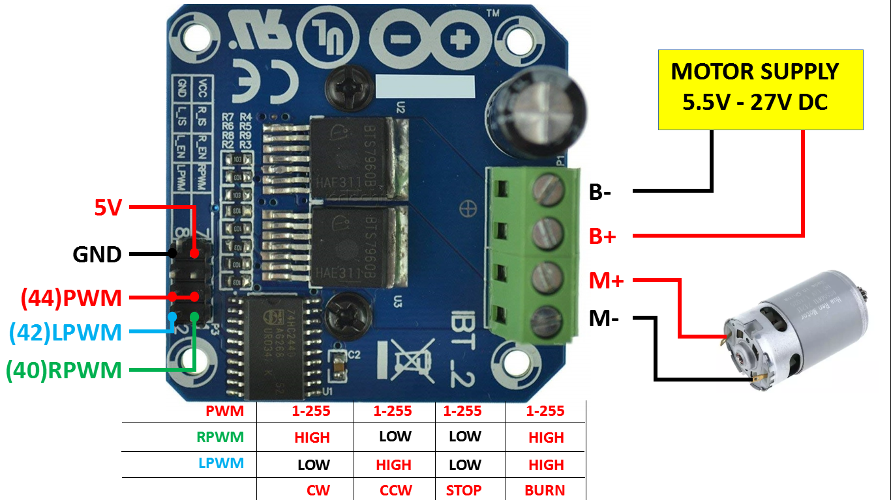
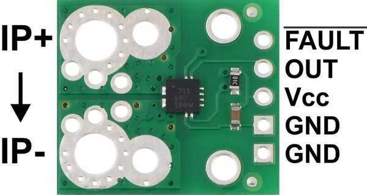

### **Peluş Oyuncaklar Kontrol Kartı**
<h1 align="center">Peluş Oyuncaklar Kontrol Kartı </h1>
<h4 align="left">İÇERİK</h4>

- [Giriş](#Giriş)
- [Çalışma Şekli](#Çalışma-Şekli)
- [Kullanılan Teknolojiler](#Kullanılan-Teknolojiler)
- [İletişim](#İletişim)

## Giriş
<p  align="center">

</p>

Yapılan çalışmada hareketli peluş oyuncaklar için kontrol kartı yapılmıştır. Geliştirilen peluş oyuncaklar çocukların üzerine binerek gezinti yapabildiği RFID kart sistemi ile entgre çalışabilen oyuncaklardır. Ülkemize genelde Çin pazarından gelmektedir.
<br><br> 

## Çalışma Şekli
RFID kart okuyucuya kart okutulduğunda oyuncak çalışmaya başlar. Oyuncak üzerinde gaz pedalı ve yön değiştirmek için anahtar bulunmaktadır. Çocuk gaz pedalına bastığı müddetçe oyuncak yön anahtarı konumuna  göre ileri yada geri yönlü hareket eder.

Kontrol kartı motorun hareketini soft start yaparak başlatır. Durma durumunda da soft stop yapılır. Kullanıcı ani hızlanma ve durmadan etkilenmez. Ayrıca ön tarafa konulan mesafe sensörü ile de önüne bir engel geldiğinde soft stop ile durur.

Kontrol kartı akünün gerilim ve akımını anlık okuyarak şarj durumunu ve aşırı akım durumunu kontrol eder. Akünün şarja ihtiyacı varsa sesli uyarı verir. Aşırı akım durumunda ise sistemi ani olarak durdurur.

<p float="center">



</p>


Motor sürücü olarak BTS 7960 modül kullanılmıştır. Akım ölçmede ise ACS711EX akım sensörü kullanılmıştır.

Ana denetleyicimiz demo aşamasında Arduino Nano'dur. Yazılımda akım ölçmek için hareketli ortalma kullanılmıştır.

## Kullanılan Teknolojiler

```bash
- Arduino Nano.
- Arduino programlama.
- P10 led modüller.


```

## Test çalışma videosu :

<a href="https://youtu.be/Q9nUwOI7k6M" target="_blank">
     
</a>

## İletişim

- GitHub [@your-ilyas9461](https://github.com/ilyas9461)
- Linkedin [@your-linkedin](https://www.linkedin.com/in/ilyas-yagcioglu/)
