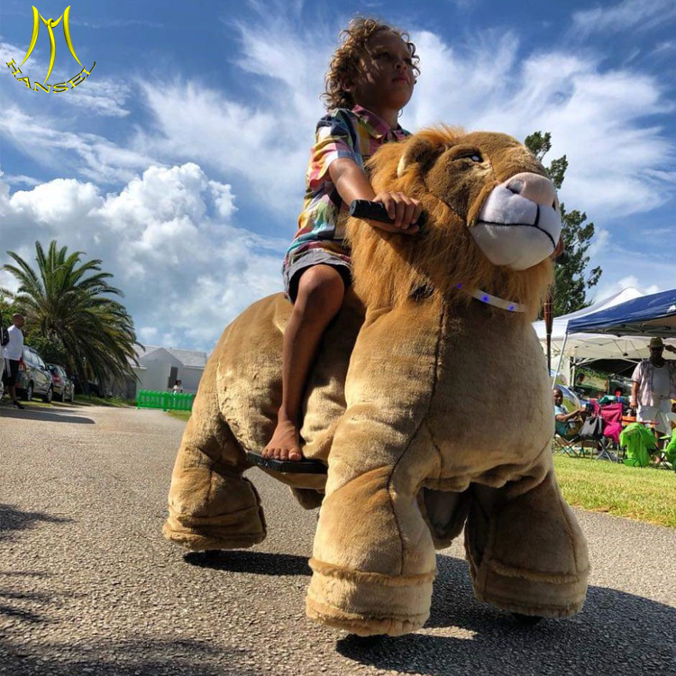
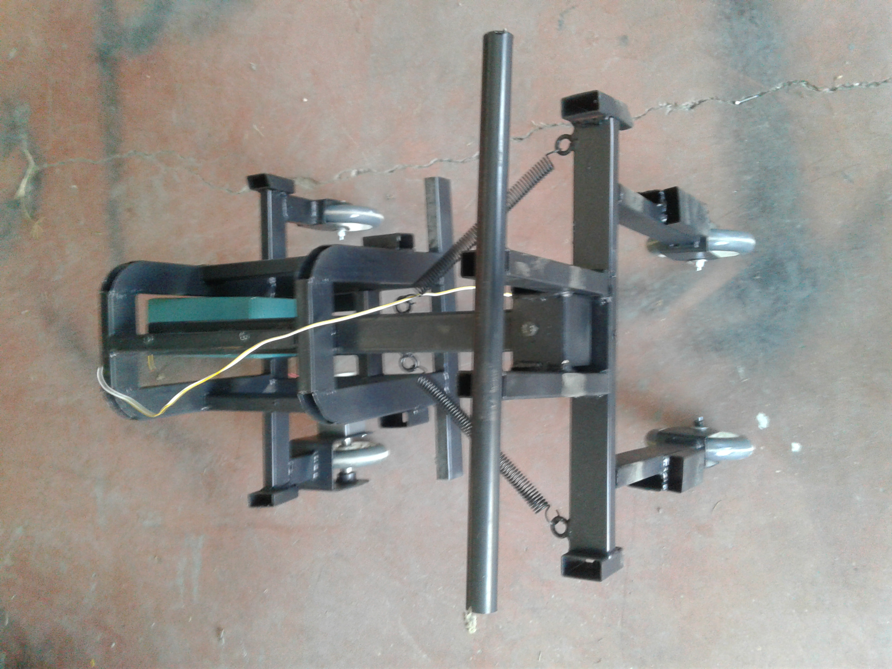

<h1 align="center">Plush Toys Control Card </h1>

### Plush Toys Control Board 

<h4 align="left">Contents</h4>

- [Giriş](#Introduction)
- [Çalışma Şekli](#How-is-it-working?)
- [Kullanılan Teknolojiler](#Used-Technologies)

## Introduction
<p  align="center">

</p>

In the study, a control card was made to move plush toys. The developed plush toys are toys that children can ride on and move around and can work with an RFID card system. It usually comes to Turkey from the Chinese market.
<br><br> 

## How is it working?
The toy starts working when the card is read into the RFID card reader. There is a gas pedal and a switch to change direction on the toy. As long as the child presses the gas pedal, the toy moves forward or backwards depending on the direction switch position.

The control card starts the movement of the motor by performing a "soft start". In case of stopping, a "soft stop" is performed. The user is not affected by sudden acceleration and stopping. In addition, with the distance sensor placed on the front, it stops with a "soft stop" when encountering an obstacle.
Kontrol kartı akünün gerilim ve akımını anlık okuyarak şarj durumunu ve aşırı akım durumunu kontrol eder. Akünün şarja ihtiyacı varsa sesli uyarı verir. Aşırı akım durumunda ise sistemi ani olarak durdurulur.

<p float="center">


</p>


BTS7960 module was used as the motor driver. ACS711EX current sensor was used for current measurement.

The moving average is used to measure current and voltage in the software. Our main controller is Arduino Nano in the demo phase. After the trials on the playing field, the entire system will be collected on a single card. Here, different controllers can be selected according to need.
<p  align="center">


<p align="center">
Picture: Empty mechanical parts and control card box.
</p>

</p>

Tests were carried out by integrating the control system into the mechanical structure. Since there is no mechanical braking in the engines we use, the movement continues a little longer when stopped. Braking is done via the motor driver software.

Links to video footage of the tests are given below.

## Used Technologies

```bash
- Arduino Nano.
- Arduino programming with c++.
- Motor drivers.
- PWM.
- mp3 player.
- Electronic circuts design and PCB

```

## Desktop test operation video :

<a href="https://youtu.be/92c82Suxs3E" target="_blank">
     
</a>

## Test video installed on mechanical structure :

<a href="https://youtu.be/wljWACHbzdw" target="_blank">
      
</a>


- GitHub [@your-ilyas9461](https://github.com/ilyas9461)
- Linkedin [@your-linkedin](https://www.linkedin.com/in/ilyas-yagcioglu/)
